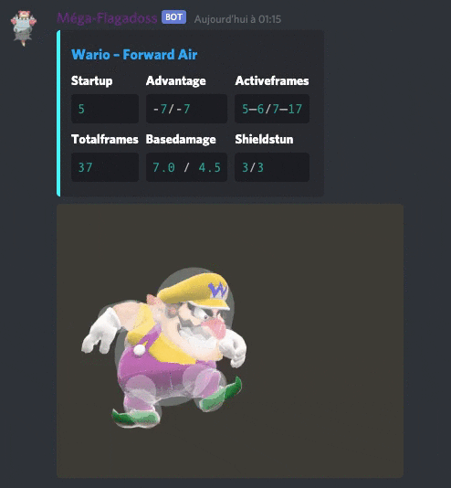

# Ramoloss : un bot très lent mais avec de multiples usages


## Déploiement
Le bot peut se déployer avec Docker-compose ou python directement.

Dans un premier temps, mettre le token discord en tant que variable d'environnement.

`export DISCORD_TOKEN=<token>`

Cloner le répertoire en local, puis aller dans le dossier.

`git clone https://github.com/titigmr/Ramoloss.git`

`cd Ramoloss`

Lancer le conteneur.

`docker-compose up`

## Dice
Module qui permet de simuler des lancers de dés. Quelques exemples d'utilisations : 

```
Roll one six sided die.
$d 1d6

Roll two four sided die.
$d 2d4

Roll one -101 to 150 sided die.
$d 1d[-101:150]

Add a one six sided die and a eight sided die (all display).
$d 1d6 + 1d8 -v

Minus a one six sided die and a eight sided die (only output).
$d 1d6 - 1d8

Add 6 at a one sided die.
$d 1d6 + 6
```

## Johns

...

## Ultimate Frame Data (UFD)




## Poll
Module permettant de créer des sondages sur Discord. Voici un exemple d'utilisation : 

```
Create a simple poll.
$poll Qui joue ?

For advanced polls use the folowing syntax:
$poll {title} [Option1] [Option2] [Option 3] ...

Note: options are limited at 21.
```
